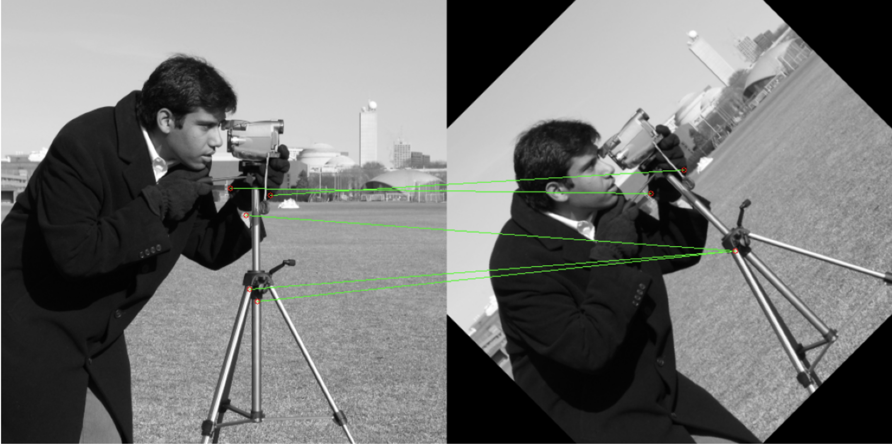

# SURF (Speeded Up Robust Features) from Scratch

This repository contains a custom Python implementation of the **Speeded Up Robust Features (SURF)** algorithm. Designed as a performant alternative to SIFT, this project implements the core logic—specifically **Integral Images** and the **Fast Hessian Detector**—from first principles to simplify the complex mathematics behind blob detection.

## Overview

**SURF** approximates the Hessian blob detector using box filters to achieve faster feature detection than traditional methods. This notebook breaks down the algorithm into its fundamental components:

1. **Integral Images:** Pre-computing the summed-area table to allow for **constant-time**  box filter operations.
2. **Hessian Determinant:** Approximating Gaussian second-order derivatives () using weighted box filters.
3. **Keypoint Localization:** Detecting maxima (blobs) across the image and scale space.
4. **Non-Maximum Suppression:** Filtering out weak responses to isolate strong feature points.

## Dependencies

To run this notebook, you will need the following Python libraries:

* **Python 3.x**
* **NumPy** (For matrix operations and integral image calculation)
* **SciPy** (Used for `maximum_filter` in Non-Maximum Suppression)
* **OpenCV** (`cv2`) (Used for image IO and visualization only)
* **Matplotlib** (For rendering plots)

### Installation

```bash
pip install numpy opencv-python matplotlib scipy jupyter

```

## Usage

1. **Clone the Repository**
```bash
git clone https://github.com/PurveshGhedia/surf-numpy-implementation.git
cd surf-numpy-implementation

```


2. **Launch Jupyter Notebook**
```bash
jupyter notebook SURF.ipynb

```


3. **Run the Cells**
Execute the notebook cells to visualize the Integral Image creation, the calculation of the Hessian Determinant map, and the final detected keypoints.

## Code Structure

The implementation is modularized into specific helper functions to maintain mathematical clarity:

* `compute_integral_image`: Converts the input image into an integral image (summed-area table).
* `get_box_sum`: Calculates the sum of pixels in any rectangular region in  time using the integral image.
* `compute_hessian_response`: Computes the determinant of the Hessian matrix for a specific pixel and filter size using box filters.
* `find_surf_keypoints`: Scans the image to generate a map of Hessian responses.
* `detect_surf_features`: The main pipeline function that coordinates scale calculation, response mapping, and non-maximum suppression to return final keypoints.

## Results

The project concludes by visualizing the detected features. It overlays the detected SURF keypoints on the original image, demonstrating the algorithm's ability to identify distinct blobs and corners.



## Comparison with SIFT

| Aspect | SIFT | SURF |
| --- | --- | --- |
| **Scale-space** | Gaussian pyramid | Box filters + Integral images |
| **Keypoint Detector** | DoG (Difference of Gaussians) | Determinant of Hessian (Fast Hessian) |
| **Orientation** | Gradient Intensity Histograms | Haar Wavelet Responses |
| **Descriptor** | 128-d Vector | 64-d Vector (Standard) |
| **Speed** | Slower | Faster (approximate) |

This implementation highlights **why SURF is computationally more efficient**, while also exposing the trade-offs introduced by approximation.

## Limitations & Future Scope

### Limitations

* **Python Overhead:** The implementation uses explicit Python loops for the sliding window operations, which is significantly slower than vectorized or C++ implementations.
* **Approximation:** Relies on box filters to approximate Gaussian derivatives, which trades slight mathematical precision for speed.
* **No Hardware Acceleration:** Does not utilize GPU (CUDA) or SIMD instructions.

### Future Scope

* **Vectorization:** Replace explicit loops with vectorized NumPy operations or convolutions for better performance.
* **Speed Optimization:** Rewrite the critical `get_box_sum` and Hessian loops using **Numba** or **Cython**.
* **Descriptor Implementation:** Extend the pipeline to generate and match 64-dimensional SURF descriptors.
* **U-SURF:** Implement "Upright SURF" (skipping rotation invariance) for scenarios where orientation is not required.
